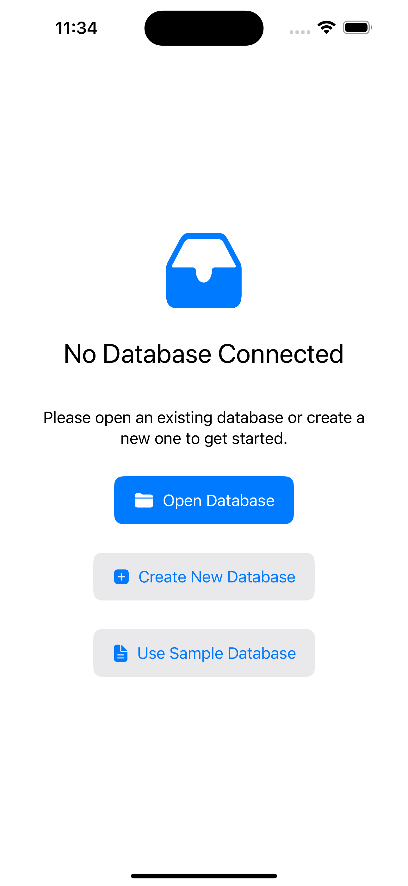
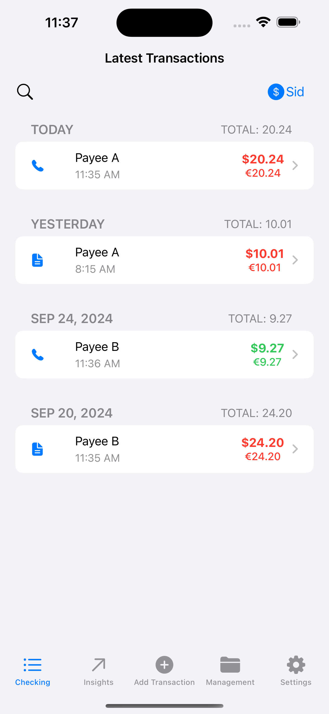
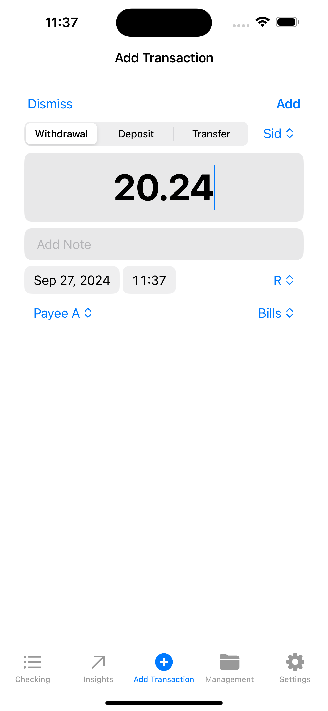
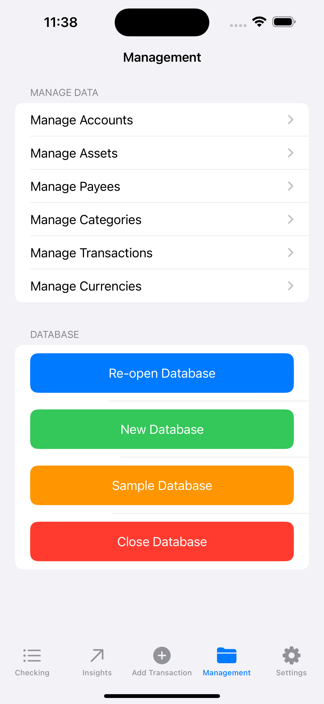

# MoneyManagerEx for iOS
Manage your finances on the go, encrypted for security, and sync via your storage

## Basic information
Money Manager Ex for iOS (MMEX4iOS) is a mobile companion to personal finance applications currently available for Android and Desktop (Windows, Mac OSX, LINUX).
[Download MMEX on the App Store](https://apps.apple.com/us/app/money-manager-ex/id6683300571)

## Tech Stacks
- [SwiftUI](https://developer.apple.com/xcode/swiftui/)
- [Swift Chart](https://developer.apple.com/documentation/charts) for reports and insights
- [SQLite.swift](https://github.com/stephencelis/SQLite.swift) for orm and data access
- [MMEX Data Model](https://github.com/moneymanagerex/database) for data compatibility
- [Dime](https://github.com/rarfell/dimeApp) for inspiration

## Screenshots

  
  
  
  
  

## Features
- Data compatible with [MMEX4Desktop](https://github.com/moneymanagerex/moneymanagerex) and [MMEX4Android](https://github.com/moneymanagerex/android-money-manager-ex/)
- Data sharable with [MMEX4Desktop](https://github.com/moneymanagerex/moneymanagerex) and [MMEX4Android](https://github.com/moneymanagerex/android-money-manager-ex/) via Files (e.g. iCloud, Synology Drive)
- Transactions
  - [X] regular transactions
  - [X] split transactions
  - [X] transfer transactions
  - [ ] scheduled transactions
- Accounts & Currencies
- Payee & Categories
- [ ] Others [MMEX features](https://moneymanagerex.org/)

## Build
- XCode, and an iPhone/iPad device (optional)
- SQLite.swift dependency via [Manual Installation](https://github.com/stephencelis/SQLite.swift?tab=readme-ov-file#manual)
- [Amplitude-iOS](https://github.com/amplitude/Amplitude-iOS) dependency via Manual Installation
- That's it, check out the code and build/run it.

## Contribute
This project is very early, and we got inspired by [Dime](https://github.com/rarfell/dimeApp). you would play as
- Developer, you can take this app dev training online course: [Getting started with Scrumdinger](https://developer.apple.com/tutorials/app-dev-training/getting-started-with-scrumdinger)
- Art and designer, for better looks, workflow, and design
- Beta Tester via [Join our TestFlight](https://testflight.apple.com/join/SYakQaAv)
- Translator 
